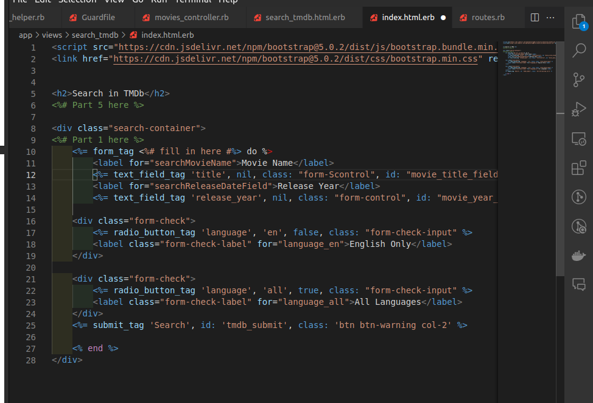

# Examen final
## Parte 1
### Pregunta 1
La pregunta uno nos pide producir un conflicto de fusión (merge) utilizando algún repositorio de las actividades realizadas.

Para ello previamente debemos tener unas dos ramas creadas las cuales harán los cambios en los mismos archivos.

Utilizando el comando `git checkout -b <nombre_de_ la rama>` creamos una nueva rama.


Relizamo los mismos pasos para crear el segundo branch


Podemos verificar los branch creados al utilizar el comando `git branch`


En esa captura podemos visualizar los branch que contiene nuestro repositorio, siendo estos `main`, `PRIMER_BRANCH`, `SEGUNDA_BRANCH`

Lo que vamos a realizar es editar el archivo readme desde ambas branch agregando `Hola desde <número-del_branch> branch`

Los pasos que vamos a realizar son los siguientes:


En el archivo README, el cual usaremos para generar el problema de fusión, vamos a colocar mensajes diferentes de diferentes branch.

En este caso utilizamos `echo "Hola dede el primer branch" > README.md` para editar el archivo.

Luego con el comando `cat README.md` visualizamos el interior del mismo.

Finalmente utilizamos los comandos de git para finalmente realizar un push a esa rama utilizando lo comandos `add`, `commit`, `push`. Tener en cuenta que en el comando push utilizamos el como argumentos el remote y la branch, en este caso `origin`, dónde está alojado nuestro repositorio y `PRIMER_BRANCH` que es la rama donde estamos.

Luego de haber realizado el push con éxitos vamos a realizar el cambio en la `SEGUNDA_RAMA`


Siguiendo los pasos realizados de la edición del archivo, el visualizarlo, y los comandos de git para agregar, commitear y pushear


Luego cambiamos al `PRIMER_BRANCH` y realizamos el merge del `SEGUNDA_BRANCH` al primero utilizando el comando merge

> [!NOTE]
> Mientras seguía avanzando con la explicación me di cuenta que estaba generando un merge conflict al editar mismos archivos en lugar del `Non-fast-forward (error)`, por lo cual se cambió el enfoque y se tuvieron que solucionar ambos conflictos que ahora serán explicados, por lo cual se procederá a generar el `Non-fast-forward (error)` en la rama `PRIMER_BRANCH`


Vamos realizar cambios desde otro directorio sin realizar el pull en uno de ellos, así no estará actualizado.


Desde otro directorio en el mismo branch realizamos cambios para obtener el conflicto


En ambos direcctorios podemos visualizar utilizando pwd que estamos en diferentes directorios.

Pra solucionarlo debemos traer los cambios con un git pull pero nos dirá el siguiente mensaje.


Por lo tanto agregamos `git pull --rebase origin PRIMER_BRANCH` 


Ahora tenemos que indicar como se realizará el rebase, en este caso utilizando --skip resolverá los problemas y podremos realizar el push.


### Pregunta 2
Tenemos el siguiente modelo User

```ruby
class User < ActiveRecord::Base
    validates :username, :presence => true
    validate :username_format
end
```

1. ¿Qué pasa si tenemos @user sin nomobre de usuario y llamamos a @user.valid?? ¿Qué guardará @user.save?

Al usar el método valid nos aseguramos que ha superado las validaciones definidas, en este caso al no tener nombre de usuario no superará la validación, por lo tanto no guardará y el user save será false

2. Implementa username_format. Para que el nombre de usuario comience con una letra y tenga como máximo 10 caracteres de largo.

```ruby
def username_format
    if username.present? and not username[0].match(/[a-zA-Z]/)
        errors.add(:username, "El nombre debe comenzar con una letra")
    end

    if username.present? and username.length > 10
        errors.add(:username, "El nombre debe tener como máximo 10 caracteres de largo")
    end
end
```

Donde hacemos usos de expresiones regulares para validar el primer caracter de username y la sentencia present?, de la misma manera el 


### Pregunta 5
¿Cuándo debería utilizar la metaprogramación basada en eval en lugar de la metaprogramación basada en bloques?

La metaprogramación basada en eval funciona cuando, valga la redundancia, evaluamos una cadena de carácteres como si fuera código, en cambio la metaprogramación basada en bloques recibe un fragmento de código como parámetro. Eval sería más usado en un contexto de comandos, mientras que bloques sería más utilizado para agregar funcionalidades a estructuras, como el ejemplo del árbol binario de las prácticas pasadas.

```ruby
class BinaryTree
  attr_accessor :valor, :izquierda, :derecha

  def initialize()
    @valor = nil
    @izquierda = nil
    @derecha = nil
  end

  def << (element)
    if @valor.nil?
      @valor = element
    elsif element <= @valor
      if @izquierda.nil?
        @izquierda = BinaryTree.new
      end
      @izquierda << element
    else
      if @derecha.nil?
        @derecha = BinaryTree.new
      end
      @derecha << element
    end
  end

  def empty?
    @valor.nil?
  end

  def each(&block)
    @izquierda.each(&block) unless @izquierda.nil?
    yield @valor
    @derecha.each(&block) unless @derecha.nil?
  end

end

arbol = BinaryTree.new
arbol << 5
arbol << 3
arbol << 7
arbol.each { |x| puts x*2 }


```

EN este ejemplo usamos bloques para el método each e imprime


```ruby
arguments = ARGV
restulado = eval(arguments[0])
puts("El resultado es: #{restulado}")
```


## Parte 2
Utilizando el repositorio brindado se realizará la siguiente actividad.

El objetivo de esta actividad es crear un controlador que reciba la solicitud del usuario y un modelo que llama al servicio TMDb remoto para obtener información de la película-

Realizamos el `bundle install --without production`


Pero luego nos solicita agregar las gemas de `faraday`, `rails-controller-testing`, `guard-rspec`.


y volvemos a ejecutar el `bundle install --without production`


Ejecutamos el comando `rails generate rspec:install` para asegurarnos de que los archivos rspec estén en su lugar.


Agregamos el `require 'byebug'` en la parte superior para acceder al depurador


Finalmente corremos el comando `rake db:migrate` para migrar la base de datos y `rails server` para correr el programa.


Verificamos que funcione correctamente


Al intentar crear una película nos sale el siguiente error:


Agregamos el siguiente código dado que no definido movie_params en el `movies_controller.rb`


Y ahora funciona correctamente:


#### Paso 1

Creamos el controlador `search_tmdb` utilizando el comando `rails generate controller search_tmdb`, el cual nos crerará el controlador, una vista, un helper, un requet, su archivo js y su archivo scss.


Luego en routes.rb agregaremos la ruta


Ya nos redirecciona a la página pero no está completada aún.



Agregamos el search_tmdb_path, el método post para enviar información al servidor y tmdb_form como identificador al form_tag. 


También agregamos un botón para ir desde la página de inicio hacia el search.


En la página se visualiza de la siguiente manera


Y al dar a return movies


Tenemos el botón search tmdb para ir hacia la búsqueda.

